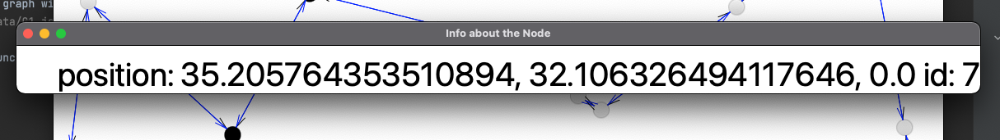

# oop-ex2

Contributors:

Eitan Kats

Ori Howard

We were given an assignment to create a graph visualizer which allows the user to run algorithms on the graph that we had to implement

## how to run the gui

To run the GUI you need to have a graph with a valid format, this is an execution example:

`java -jar graph-visualizer.jar data/G1.json `

The UI supports running all the functionality that was requested:
1. add/remove node
2. add/remove edge
3. center
4. tsp
5. shortestPath
6. shortestPathDist
7. isConnected
8. loading and saving graph to disk

Each time you run an algorithm make sure you clean the graph.
clicking on a node displays information about it

## Using the GUI

In the Gui you are able to run all the algorithms implemented in the Exercise:
1. load/save current graph
2. edit the graph
   1. add/remove an edge
   2. add/remove a node
3. run an algorithm - after running each algorithm clean the graph before you execute the next one (click on clean)
   1. tsp - displays the shortest path that goes through the given nodes in an optimal way and highlights the nodes
   2. center - highlights the center of the graph
   3. shortestPath - the shortest path between two nodes and highlights it
   4. isConnected - displays a message whether the graph is connected or not
   5. shortestPathDist - displays the minimal distance between two nodes
4. clean - cleaning the graph
5. reset - resets the graph to it's initial state

clicking on a node displays information about it like its location and the id and so on

## Idea of the GUI implementation
the GUI has 3 classes - the main class which is GraphGUI and 2 other classes: MyTimer, GraphScale
we choose to use JavaFx for this implementation.

#### GraphScale class
this class has a very specific role - it takes a point and changes the X and Y coordinates to fit
for every window size.  
this class has 2 functions: 
 
setRange() - this function finds the minimum and the maximum points.  
convert() - this function gets a point and changes its coordinates accordingly to the window size.  

#### MyTimer class
this class extends AnimationTimer  
it has a main function - 'Handle' - which allow us to iterate through all the nodes and edges to draw each one of them in the window displayed.  
the other functions in the class have different calculations which help us to draw the graph correctly.  
main functions:  

connectNode() - this function connect all the edges between the nodes.  
drawArrow() - this function draw a little arrow to make the graph directed.  
drawNodes() - this function draw all the nodes in the graph.  

#### GraphGUI class
this class is the main class of the GUI and it extends Application  
the Application interface has one main function that runs the whole algorithm - 'start'  
we use this class for our main window which displays the toolbar,the graph itself.  
the toolbar has different options:  

File - you can save and load any json file graph.  
Edit - you can edit the graph by adding and removing different nodes and edges.  
RunAlgorithm - you can choose to run any algorithm from the DirectedGraphAlgorithm class.  
clean - cleaning the graph and the colors of the nodes.  
reset - role back all the changes and displays the original graph.  

## Idea of implementation

we wanted to create a graph the meets all the requirements of the functions in the classes,
and we can run algorithms efficiently on it

The way we chose to represent the graph is:

1. nodeMap - this is a hashmap which contains all the nodes of the graph, the key is the id of the node and the value is the node itself
2. parsedEdges - this is a list of the edges that are in the graph
3. MCount - this is the variable used to track the changes made to the graph

Each node comprises the following:
1. pos - GeoLocation of the graph node
2. id - the id of the node
3. weight - the weight of the node
4. destMap - a hashmap that maps between the nodes that this node can reach and the edges that reach them 
5. sourceMap - a hashmap that maps between a node and the sources that can each is
6. tag - This contains a tag from the Enum mainly used for coloring in the algorithms

Each edge comprises the following:
1. source - the id of the source node
2. dest - the id of the dest node
3. weight - the weight of the edge

The following algorithms were the core of the project:

* Dijkstra - We have implemented the Dijkstra algorithm with the minimum heap
source of the Dijkstra algorithm: https://en.wikipedia.org/wiki/Dijkstra%27s_algorithm
* DFS - When we check whether the graph is connected we use two iterations of DFS, the first one on the original graph which inverses the graph and a 2nd one on the inverse graph

## Class overview

### DecoratedGraphIterator
This is a usage of the Decorator pattern

This is a wrapper class that decorates the Iterators of the graph so that it can behave according to the graph's state.
if the graph changes during the Iteration it will throw an exception.

in order to check if the graph has changed we are using the MCount

### DirectedGraph
This is an implementation of the `DirectedWeightedGraph`.
The details about the design of this class are in the [idea of Implementation section](##ideaOfImplementation)

### DirectedGraphAlgorithms
This class is an implementation of the `DirectedWeightedGraphAlgorithms` interface
contains implementation of Dijkstra,dfs,tsp as they were described above.

### GraphEdge
An object representing an edge in the graph

### GraphNode
An object representing an node in the graph

### NodeLocation
An object representing the location of the node, this is used in the GUI to draw the nodes

### NodeTagEnum
This Enum is used when traversing through the graph (DFS) to tag the nodes that are being traversed

### PosSerializer
A serializer class used to write the data to a json file

## Detailed execution details of the algorithms

| Graph Size | isConnected | Center  |
|------------|-------------|---------|
| 1000       |   380msec   | 1.6 sec |
| 10k        |   1.9sec    | 4.1 Min |
| 100k       |   17sec     |too long |
| 1M         |   51sec     |too long |
| G1 (16)    |   79msec    |  81msec  |
| G2 (31)    |   84msec    |  90msec |
| G3 (48)    |   93msec    | 101msec |

